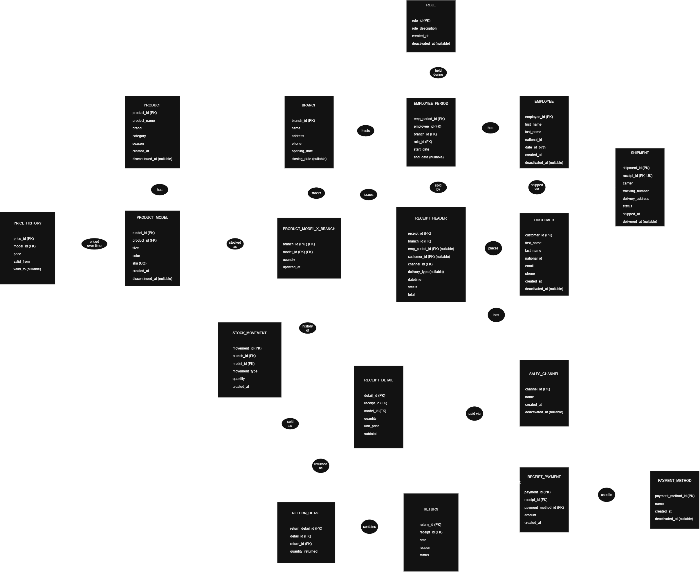

# School Shoe Store Chain — Logical Data Model

This document defines the logical entity-relationship model for a
multi-branch school shoe retail chain, covering in-store and online
sales, returns, inventory, employment history, and stock auditability.
Promotions are explicitly out of scope for this iteration.

Data types, constraints, and indexes are intentionally **not** defined
here — they belong to the physical model.

## Entity-Relationship Diagram

*Diagram source: [`logical-data-model.drawio`](../ShoeStoreChain_Logical_Model.drawio).
Entity attributes and cardinalities are not shown on the diagram — see
the sections below.*

## Entities and Attributes

### Catalog

**PRODUCT**
| Attribute | Key | Notes |
|---|---|---|
| product_id | PK | |
| product_name | | |
| brand | | |
| category | | boys / girls / unisex |
| season | | |
| created_at | | |
| discontinued_at | | nullable |

**PRODUCT_MODEL**
| Attribute | Key | Notes |
|---|---|---|
| model_id | PK | |
| product_id | FK | |
| size | | |
| color | | |
| sku | UQ | |
| created_at | | |
| discontinued_at | | nullable |

**PRICE_HISTORY**
| Attribute | Key | Notes |
|---|---|---|
| price_id | PK | |
| model_id | FK | |
| price | | |
| valid_from | | |
| valid_to | | nullable |

### Employment

**BRANCH**
| Attribute | Key | Notes |
|---|---|---|
| branch_id | PK | |
| name | | |
| address | | |
| phone | | |
| opening_date | | |
| closing_date | | nullable |

**EMPLOYEE**
| Attribute | Key | Notes |
|---|---|---|
| employee_id | PK | |
| first_name | | |
| last_name | | |
| national_id | | |
| date_of_birth | | |
| created_at | | |
| deactivated_at | | nullable |

**ROLE**
| Attribute | Key | Notes |
|---|---|---|
| role_id | PK | |
| role_description | | |
| created_at | | |
| deactivated_at | | nullable |

**EMPLOYEE_PERIOD**
| Attribute | Key | Notes |
|---|---|---|
| emp_period_id | PK | |
| employee_id | FK | |
| branch_id | FK | |
| role_id | FK | |
| start_date | | |
| end_date | | nullable |

### Inventory

**PRODUCT_MODEL_X_BRANCH**
| Attribute | Key | Notes |
|---|---|---|
| branch_id | PK, FK | |
| model_id | PK, FK | |
| quantity | | |
| updated_at | | |

**STOCK_MOVEMENT**
| Attribute | Key | Notes |
|---|---|---|
| movement_id | PK | |
| branch_id | FK | |
| model_id | FK | |
| movement_type | | domain: **ADD, DEDUCT** |
| quantity | | |
| created_at | | |

### Sales

**SALES_CHANNEL**
| Attribute | Key | Notes |
|---|---|---|
| channel_id | PK | |
| name | | in_store, online |
| created_at | | |
| deactivated_at | | nullable |

**CUSTOMER**
| Attribute | Key | Notes |
|---|---|---|
| customer_id | PK | |
| first_name | | |
| last_name | | |
| national_id | | |
| email | | nullable |
| phone | | nullable |
| created_at | | |
| deactivated_at | | nullable |

**RECEIPT_HEADER**
| Attribute | Key | Notes |
|---|---|---|
| receipt_id | PK | |
| branch_id | FK | |
| emp_period_id | FK | nullable |
| customer_id | FK | nullable — guest checkout |
| channel_id | FK | |
| delivery_type | | nullable |
| datetime | | |
| status | | domain: **PENDING, APPROVED, REJECTED, COMPLETED** |
| total | | |

**RECEIPT_DETAIL**
| Attribute | Key | Notes |
|---|---|---|
| detail_id | PK | |
| receipt_id | FK | |
| model_id | FK | |
| quantity | | |
| unit_price | | snapshot — see business rules |
| subtotal | | |

**RECEIPT_PAYMENT**
| Attribute | Key | Notes |
|---|---|---|
| payment_id | PK | |
| receipt_id | FK | |
| payment_method_id | FK | |
| amount | | |
| created_at | | |

**PAYMENT_METHOD**
| Attribute | Key | Notes |
|---|---|---|
| payment_method_id | PK | |
| name | | |
| created_at | | |
| deactivated_at | | nullable |

**SHIPMENT**
| Attribute | Key | Notes |
|---|---|---|
| shipment_id | PK | |
| receipt_id | FK, UQ | |
| carrier | | |
| tracking_number | | |
| delivery_address | | |
| status | | domain: **PENDING, APPROVED, REJECTED, COMPLETED** |
| shipped_at | | |
| delivered_at | | nullable |

### Returns

**RETURN**
| Attribute | Key | Notes |
|---|---|---|
| return_id | PK | |
| receipt_id | FK | |
| date | | |
| reason | | |
| status | | domain: **PENDING, APPROVED, REJECTED, COMPLETED** |

**RETURN_DETAIL**
| Attribute | Key | Notes |
|---|---|---|
| return_detail_id | PK | |
| detail_id | FK | |
| return_id | FK | |
| quantity_returned | | |

## Relationship Summary

### Catalog

| Relationship | Cardinality | Notes |
|---|---|---|
| Product → ProductModel | 1:N | A product has many size/color variants |
| ProductModel → PriceHistory | 1:N | Price is universal (not per branch) and versioned over time |

### Employment

| Relationship | Cardinality | Notes |
|---|---|---|
| Branch → EmployeePeriod | 1:N | One branch hosts many employment periods |
| Employee → EmployeePeriod | 1:N | Supports unlimited hire/resign/rehire cycles |
| Role → EmployeePeriod | 1:N | Role held during a specific period |

**Business rule:** an employee's `EmployeePeriod` rows must not have overlapping date ranges.

### Inventory

| Relationship | Cardinality | Notes |
|---|---|---|
| Branch → ProductModelXBranch | 1:N | Stock tracked per branch |
| ProductModel → ProductModelXBranch | 1:N | Same variant can have stock rows in multiple branches |
| ProductModelXBranch → StockMovement | 1:N | Auditable history of quantity changes over time, categorized by `movement_type` |

### Sales

| Relationship | Cardinality | Notes |
|---|---|---|
| Branch → ReceiptHeader | 1:N | Every receipt is always associated with a branch, including online sales |
| Customer → ReceiptHeader | 0/1:N | Optional — guest checkout (walk-in, cash, no customer record) |
| EmployeePeriod → ReceiptHeader | 0/1:N | Optional; captures branch + role at time of sale |
| SalesChannel → ReceiptHeader | 1:N | in_store or online |
| ReceiptHeader → ReceiptDetail | 1:N (min 1) | A receipt cannot exist with zero line items. **Not enforceable via FK alone** — requires a `CHECK`/trigger or application-level validation at the physical layer |
| ProductModel → ReceiptDetail | 1:N | |
| ReceiptHeader → ReceiptPayment | 1:N | Supports split/combined payment methods |
| PaymentMethod → ReceiptPayment | 1:N | |
| ReceiptHeader → Shipment | 1:0/1 | Only when `delivery_type = shipping` |

**Business rule:** `ReceiptDetail.unit_price` is a snapshot taken from `PriceHistory` at time of sale — never recalculated later.

### Returns

| Relationship | Cardinality | Notes |
|---|---|---|
| ReceiptHeader → Return | 1:N | A receipt can have multiple return events over time |
| Return → ReturnDetail | 1:N (min 1) | Same enforcement caveat as ReceiptHeader → ReceiptDetail |
| ReceiptDetail → ReturnDetail | 1:N | Total quantity returned must never exceed original quantity sold |

## Business Rules Without a Direct Foreign Key

These are resolved by the application at write time, not enforced by a structural relationship:

- **Price lookup:** when creating a `ReceiptDetail`, the application looks up the currently valid row in `PriceHistory` (`valid_from <= date <= valid_to`) and copies it into `unit_price`.
- **Stock decrement:** when creating a `ReceiptDetail`, the application decrements `quantity` on the matching `ProductModelXBranch` row (same `branch_id` + `model_id`), and inserts a corresponding `StockMovement` row with `movement_type = SALE`.

## Value Domains (To Be Finalized)

Enum-like fields are intentionally left untyped in the logical model.
Their value sets must be defined here before the physical model is
implemented, since they become `CHECK` constraints or Postgres `ENUM`
types directly:

- `RECEIPT_HEADER.status` — **PENDING, APPROVED, REJECTED, COMPLETED**
- `RETURN.status` — **PENDING, APPROVED, REJECTED, COMPLETED**
- `SHIPMENT.status` — **BOOKED, IN_TRANSIT, DELIVERED, ON_HOLD, CANCELLED**
- `STOCK_MOVEMENT.movement_type` — **SALE, RESTOCK, RETURN, ADJUSTMENT**

## Out of Scope (Current Iteration)

- Promotions and discounts.
- Serialized / per-unit physical inventory tracking (stock is tracked as an aggregate quantity per branch + variant, not per individual physical unit).
