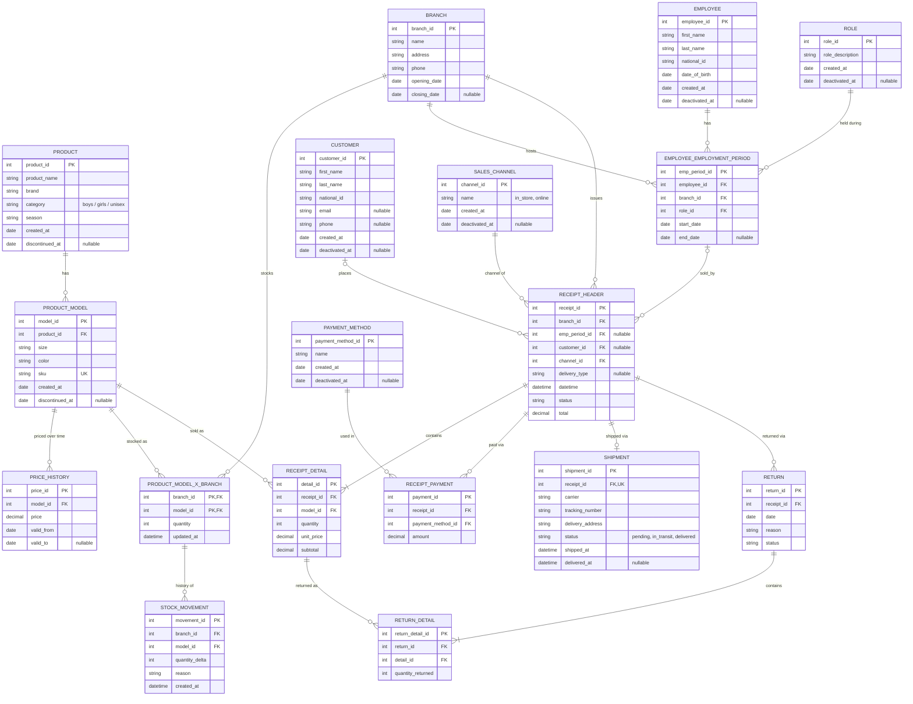

# School Shoe Store Chain — Logical Data Model

This document defines the logical entity-relationship model for a
multi-branch school shoe retail chain, covering in-store and online
sales, returns, inventory, employment history, and stock auditability.
Promotions are explicitly out of scope for this iteration.

Data types, constraints, and indexes are intentionally **not** defined
here — they belong to the physical model.

## Entity-Relationship Diagram

## Relationship Summary

### Catalog

| Relationship | Cardinality | Notes |
|---|---|---|
| Product → ProductModel | 1:N | A product has many size/color variants |
| ProductModel → PriceHistory | 1:N | Price is universal (not per branch) and versioned over time |

### Employment

| Relationship | Cardinality | Notes |
|---|---|---|
| Branch → EmployeeEmploymentPeriod | 1:N | One branch hosts many employment periods |
| Employee → EmployeeEmploymentPeriod | 1:N | Supports unlimited hire/resign/rehire cycles |
| Role → EmployeeEmploymentPeriod | 1:N | Role held during a specific period |

**Business rule:** an employee's `EmployeeEmploymentPeriod` rows must not have overlapping date ranges.

### Inventory

| Relationship | Cardinality | Notes |
|---|---|---|
| Branch → ProductModelXBranch | 1:N | Stock tracked per branch |
| ProductModel → ProductModelXBranch | 1:N | Same variant can have stock rows in multiple branches |
| ProductModelXBranch → StockMovement | 1:N | Auditable history of quantity changes over time |

### Sales

| Relationship | Cardinality | Notes |
|---|---|---|
| Branch → ReceiptHeader | 1:N | Every receipt is always associated with a branch, including online sales |
| Customer → ReceiptHeader | 0/1:N | Optional (guest checkout) |
| EmployeeEmploymentPeriod → ReceiptHeader | 0/1:N | Optional; captures branch + role at time of sale |
| SalesChannel → ReceiptHeader | 1:N | in_store or online |
| ReceiptHeader → ReceiptDetail | 1:N (min 1) | |
| ProductModel → ReceiptDetail | 1:N | |
| ReceiptHeader → ReceiptPayment | 1:N | Supports split/combined payment methods |
| PaymentMethod → ReceiptPayment | 1:N | |
| ReceiptHeader → Shipment | 1:0/1 | Only when `delivery_type = shipping` |

**Business rule:** `ReceiptDetail.unit_price` is a snapshot taken from `PriceHistory` at time of sale — never recalculated later.

### Returns

| Relationship | Cardinality | Notes |
|---|---|---|
| ReceiptHeader → Return | 1:N | A receipt can have multiple return events over time |
| Return → ReturnDetail | 1:N (min 1) | |
| ReceiptDetail → ReturnDetail | 1:N | Total quantity returned must never exceed original quantity sold |

## Business Rules Without a Direct Foreign Key

These are resolved by the application at write time, not enforced by a structural relationship:

- **Price lookup:** when creating a `ReceiptDetail`, the application looks up the currently valid row in `PriceHistory` (`valid_from <= date <= valid_to`) and copies it into `unit_price`.
- **Stock decrement:** when creating a `ReceiptDetail`, the application decrements `quantity` on the matching `ProductModelXBranch` row (same `branch_id` + `model_id`), and inserts a corresponding `StockMovement` row.

## Out of Scope (Current Iteration)

- Promotions and discounts.
- Serialized / per-unit physical inventory tracking (stock is tracked as an aggregate quantity per branch + variant, not per individual physical unit).